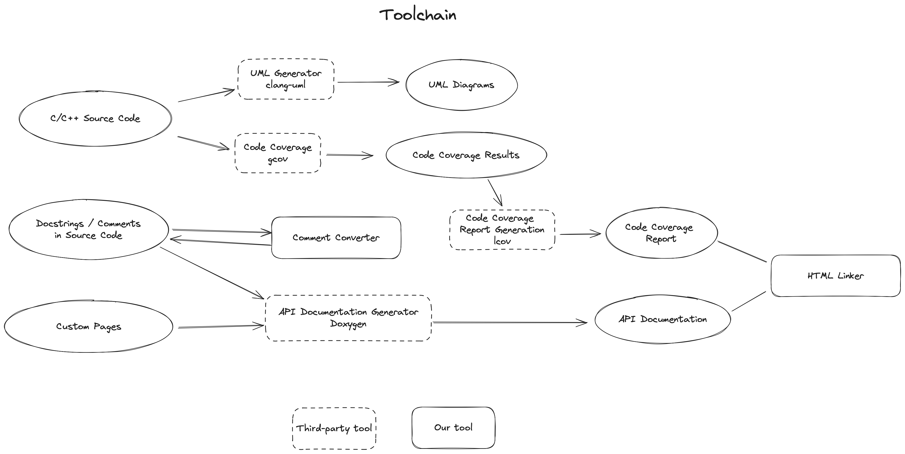

# SourceToDoc

Open-source toolchain for retro-actively extracting as much information regarding documentation and design as possible from arbitrary open-source software projects' source code with a minimum amount of required prior knowledge.

For instructions, go [here](#setup-and-usage).

# About
The main intention for this project was to create a tool to make it easier to evaluate open-source software for use in safety-related projects,
where using open-source software often comes with the downside of being somewhat lacking when it comes to specification, documentation or proper evaluation/testing.  
Although generating 100-page specification sheets out of "thin air" is an impossible deed, evaluating if software is suitably for safety applications or even properly producing extensive specifications is much easier when there already is "some foundation" rather tahn "thin air".      

The toolchain is built around various open-source tools and aims to provide good usability to be accessibly to any user without much of a learning curve, while also being a powerful, feature-rich, highly configurable tool when desired.  
Currently, the toolchain consists of three "major tools":
- **Comment Converter:** Modify comments/non-functional sections of a project's source code to be better suited for upcoming steps. This includes: 
  - minor formatting changes to make previously overlooked (due to improper formatting) comments appear where they refer to
  - asking a Large Language Model to completely re-arrange contents of such "docstring comments" to better incorporate them into the later documentation as a whole
  - various other independent "comment reformatting options"
- **Documentation Generator:** Analyse the entire source files of a project, including source code and inline documentation, and use it, to generate elaborate (API) documentation/"wiki pages":
  - documentation output as HTML pages ready to be hosted on a web server
  - separate, but well-integrated pages for each file, class, function, etc. containing all available details
  - sorting/listing options for all files, classes, functions, etc. and a general search function
  - interlinking between all identified names of functions, fields, files, classes etc.
  - inclusion of all found inline documentation next to the class, function, member, etc. they refer to
  - various interactive graphics (class graphs, function call(er) graphs, file include(d by) graphs, ...) within the documentation pages, to allow for easier and better understanding of the project's architecture
  - access to most of the underlying tool's (Doxygen) features and configurability, but more streamlined to be less convoluted and robust, to make it easier to not accidentally break the toolchain
- **Test Coverage Evaluator:** Run all tests defined in the project (required project to build and execute properly), analyze the test coverage and generate a detailed interactive report:
  - find out if the existing tests provide quality or if they are just for show
  - measure combined and test coverage for each part of the project (down to per-function level) separately and identify untested sections
  - outputs also as web-server-ready HTML pages
  - when (API) documentation was generated, pages regarding teh same files/functions are interlinked (i. e. test coverage site of main.cpp contains a link to API documentation of main.cpp and vice versa)
  - might be the first open-source, publicly available, non-commercial solution for this kind of interlinking

## Compatibility and Known Limitations
- Generating the dot-tool-based graphics in the API documentation can increase the runtime massively, but as long as the runtime appears to be finite, they may still be worth it :)
- The "additional" PlantUML-based graphics are still in a more "proof of concept" state, meaning they are not included in the documentation as neatly as the dot-tool-based graphics and could potentially be bloated due to including dependencie relations transcending the projects' source files 
- Test Coverage Evaluation supported for projects based on the following build systems:
  - meson
  - CMake?
  - Make?
- Because of the more "open" nature of build systems like CMake or Make, they are nigh impossible to automatize reliably for arbitrary software projects and the user may have to manually interfere more than desirable:
  - For CMake and Make projects with already existing test(coverage) configurations, the user has to find out the proper arguments/"name" to run them in this way and provide them to toolchain as argument
  - For CMake and Make projects with no existing configuration for tests/testcoverage, the user unfortunately may have to do some modifications to the CMakeList.txt/MAKEFILE
- Interlinking of generated API documentation and test coverage reports may fail for files/directories with duplicate names (i.e. multiple `src`directories when using subprojects). however, this likely only affects interlinking of the affected files, as linking of other files, including the index pages, should still work
- We have no known setup where interlinking of API documentation and test coverage reports work for meson projects when running on Windows
  - issue of getting ninja recognizing a "lcov installation" on Windows
  - Backup is to use gcovr instead of lcov, which does generate a test coverage report, but hashed filenames of gcovr output break our interlinking process
- Running the toolchain on macOS is likely possible (with some concerns mostly regarding test coverage evaluation), but the toolchain was not tested properly in its entirety while running on macOS an we can not provide detailed installation instructions. 

For more detailed evaluation results on various sample projects, see [EvaluationResults.md](doc/EvaluationResults.md)

# Setup and Usage

## Setup
To ensure that all submodules are also cloned, use the following command:
```sh
git clone --recurse-submodules https://github.com/chelast55/SourceToDoc.git
```
### Linux (Debian/Ubuntu)
When using Linux, you have to begin the following example commands with `python3` instad of `python`, if you have not installed `python-is-python3`.  
All Dependencies can be installed via *apt* and *pip* packet managers.  
If you have not installed `python(3.12)` yet or your default `python(3)` version is older than `3.12`, install it first (`python3.12` and `python3.12-venv` via apt) and make sure 
to address it with `python3.12`.  
In case you are required to add something to apt and `apt-add` can not be found, try `sudo apt install software-properties-common`.  
With that out of the way, you can continue installing the non-python dependencies via apt:
```sh
sudo apt install python3-venv doxygen graphviz cmake libcmocka-dev lcov
```
`graphviz` is only necessary when generating the various graphics is desired.
`cmake`, `libcmocka-dev` and `lcov` are only required when evaluating test coverage is desired.  
Next, navigate to or open a terminal in the main directory of the freshly downloaded repository (SourceToDoc).  
There, create a virtual environment and activate it:
```sh
python -m venv venv
source venv/bin/activate
```
Within the virtual environment (likely indicated by a `(venv)` at the beginning of your command line), you can install the python dependencies:
(additional requirements are not required for python includes, but for running the test coverage part of the toolchain)
```sh
pip install -r requirements.txt
pip install -r requirements_additional.txt
pip install pytest  # only required if you want to run the unit tests for this toolchain
```
Now, you should be able to run the whole toolchain!

### Windows
Disclaimer: **We really do NOT recommend running the Testcoverage Evaluation part of the toolchain under Windows, if you do not ABSOLUTELY REQUIRE test coverage data in an Windows environment**.  
The reason for this is the rather complicated installation process compared to running the toolchain under (Ubuntu) Linux and missing support for ceratin features (e. g. interlinking documentation and test coverage output for projects with meson build system (more on that later)).

Various Dependencies have to be installed manually on Windows.
Most of them have installer executables:
(Where applicable, make sure, the box for adding it to the Windows Path is ticked!)
- Python 3.12: https://www.python.org/downloads/
- Doxygen: https://www.doxygen.nl/download.html
- Graphviz: https://graphviz.org/download/
- CMake: https://cmake.org/download/ (only necessary for Test Coverage Evaluation)
You should at least reboot once after all of them are installed (), to ensure, Path is updated.

If you, despite all the warnings, **DO plan to use the Test Coverage Evaluation** part of the toolchain on Windows, **proceed with the steps described in** [SetupTestCoverageWindows.md](doc/SetupTestCoverageWindows.md) **first**. 

All remaining Dependencies can be installed via the *pip* packet manager.
To do so, navigate to or open a PowerShell terminal in the main directory of the freshly downloaded repository (SourceToDoc).  
There, create a virtual environment and activate it:
```commandline
python -m venv venv
venv\Scripts\Activate.ps1
```
Within the virtual environment (likely indicated by a `(venv)` at the beginning of your command line), you can install the python dependencies:
(additional requirements are not required for python includes, but for running the test coverage part of the toolchain)
```commandline
pip install -r requirements.txt
pip install -r requirements_additional.txt
pip install pytest  # only required if you want to run the unit tests for this toolchain
```
Now, you should be able to run the whole toolchain!

### Testcoverage with cmake
If your project doesn't yet support testcoverage generation with gcov, the simplest way of adding it is to use the [CodeCoverage.cmake file](https://github.com/bilke/cmake-modules/blob/master/CodeCoverage.cmake).
Basic usage is comprised of 3 steps:
- Add the file to your project (e.g. in a subfolder named /modules).
- Include it in your main CmakeLists.txt: 
```
list(APPEND CMAKE_MODULE_PATH ${CMAKE_CURRENT_LIST_DIR}/modules)
include(CodeCoverage)
append_coverage_compiler_flags()
```
- Execute our toolchain ```python main.py --project_name name --tc_coverage_type cmake``` 
The CodeCoverage.cmake file warns you if you don't build in DEBUG mode, as the results can be misleading. To enable DEBUG mode pass our flag ```--tc_cmake_configure_args``` the argument ```-DCMAKE_BUILD_TYPE=Debug``` in addition to the relative path from the build location to the CmakeList.txt file (```..``` typically). Final usage would look something like ```python main.py --project_name name --tc_coverage_type cmake --tc_cmake_configure_args "-DCMAKE_BUILD_TYPE=Debug .."```

## Usage
The easiest way to run the toolchain is to use the "wizard", which gives a "guided tour" through the most important parameters and lets you set one after another.
Note, that this may not be the fastest way and not all possible CLI parameters to control the toolchain are available.  
To run the toolchain with the wizard enabled run the following in a terminal opened in the toolchain's main directory (same level as `main.py`):
```commandline
python main.py -W
```

When not using the wizard, to run the toolchain in its most basic version, you have to provide at least the name of the directory (`<PROJECT_NAME>`) containing the source of the project, you want to document:   
(the `<PROJECT_NAME>` directory and your terminal instance should be in the same directory, where `main.py` is located and the Python virtual environment should be active)

```commandline
python main.py --project_name <PROJECT_NAME>
```
Depending on the software project you try to document, you may not get the most out of the generated documentation. 
The source code may contain incorrectly formatted docstrings, which causes symbols (function/variable/class names etc.) not to be recognized/linked correctly or the entire docstring not to appear in the documentation at all.  
  
An additional component of the toolchain, the *comment converter*, can be enabled to preprocess the encountered docstrings. Thus, the **recommended** basic version to run the toolchain is as follows:  
(this will modify the source code (more precisely: change // and /* ... /* on symbols to /** ... */ in this case))
```commandline
python main.py --project_name <PROJECT_NAME> --converter
```
Just enabling the *comment converter* like this will likely solve the issue of docstrings not being recognized. For even better results (where symbols are resolved more correctly), 
an OpenAI-API-compatible Large Language Model (LLM) can be used to preprocess docstrings:
```commandline
python main.py --project_name test --project_path <path> --converter function_comment_llm --cc_openai_base_url <url> --cc_openai_api_key <key> --cc_llm_model <model>
```
For more details about the comment converter tool's capabilities, see [UsageConverter.md](doc/UsageConverter.md), [AboutExtractor.md](doc/AboutExtractor.md), [AboutCommentStyleConverter.md](doc/AboutCommentStyleConverter.md) and [ArchitectureConverter.md](doc/ArchitectureConverter.md).

If desired, all components of the toolchain can be disabled individually (`disable_doc_gen`for *documentation generation* and `disable_test_cov` for *test coverage evaluation*).  
Some recommended additional options would be `--project_number` and `--project_brief`.  
There also is another tool for generating further UML diagrams, which is not perfectly included, but runs fine (see [UsageUML.md](doc/UsageUML.md) for details).
For all possible options, see:
```commandline
python main.py --help
```

An alternative way to set CLI options (one that does not involve stringing together multiple options to one long command) is to specify them in a config file.
This file should use [YAML syntax](https://docs.ansible.com/ansible/latest/reference_appendices/YAMLSyntax.html) and consist of one large dictionary.
For flag arguments (i.e. arguments that do not parse a value), the value can be left empty. This should look somewhat like this:
```yaml
argument: value1
flag_argument: 
another_argument: value2

```
The toolchain will use configurations from the config file specified with `--config`. When this option is used, arguments can still be given via the command line and will even overwrite values for the same argument specified in the config file.  
More practical examples can be found in [doc/examples] and include the following:
- [example_config.yaml](doc/examples/example_config.yaml): Equivalent to the command line example of the simplest recommended use (with converter enabled, but without LLM), but expecting a project in `example_project`.
- [example_config_with_llm.yaml](doc/examples/example_config_with_llm.yaml): Equivalent for the command line example featuring an LLM (assuming the LLM is "llama3" running via [Ollama](https://ollama.com/))
````commandline
python main.py --config example_config.yaml
````

### Testcoverage

Note: tc_coverage_type is meson by default. Remember setting this to cmake or generic if you use these.

When the testcoverage part of our toolchain set to cmake throws an error you might need to pass additional arguments to the individual build steps.
Cmake default handling is creating a "build" folder in the root dir of the give project and executing ```cmake ..```, ```cmake --build .```, ```ctest``` and locv/genhtml from there.  
If any additional arguments are passed to the individual steps the relative path (```..``` for the configure step; ```.``` for the build step) will be overridden.  
Therefore you need to pass the relative path aswell e.g. ```--tc_cmake_configure_args "-DCMAKE_BUILD_TYPE=Debug .."``` (take note of the "..")

Using tc_coverage_type = generic expects usage of ```--tc_generic_report_location```, where an already built coverage report is located. This means building and executing lcov/genhtml has to be done by the user beforehand.  

If you used doxygen-awesome and want a similar, more "modern" look for the test coverage report, you may want to take a look at [dark-lcov](https://github.com/civts/dark-lcov)

# Miscellaneous

## Toolchain Component Overview
The following schematic depicts the interaction between various components of the toolchain.

One thing, that is not shown, is that CLI/config args are also collected at a "single point" (whenn running `main.py`) and, following that, are preprocessed/filtered (for better usability) and, following that, redistributed to the tool they affect.

## Architectural Decision Records
Certain fundamental architectural decisions were captured as MADRs:
- [Converter Default Case](doc/madr/ConverterDefaultCase.md)
- [Documentation Generator](doc/madr/DocumentationGenerator.md)
- [Test Coverage Automation](doc/madr/TestCoverageAutomation.md)
- [Test Coverage Report Generator](doc/madr/TestCoverageReportGenerator.md)
- [Additional UML Diagram Integration](doc/madr/AdditionalUMLIntegration.md)

## File Hierarchy
The following structure assumes that `--apidoc_toolchain` is set to `doxygen-only` as it is the only currently maintained option.
For legacy documentation regarding `sphinx-based`, see [here](doc/file_hierachy_REDUNDANT.md).
```
SourceToDoc
├───<PROJECT>
│   └───<...>
├───doc
│   ├───DoxygenParamEvaluation.md
│   └───<...>
├───out
│   └───<PROJECT>
│       ├───doc
│       │   ├───<...>
│       │   └───index.html
│       ├───testcoveragereport
│       │   ├───<...>
│       │   └───index.html
│       └───uml
│           ├───<...>
│           └───index.html
├───sourcetodoc
│   ├───cli
│   │   ├───<...yaml>
│   │   └───<...py>
│   ├───docstring
│   │   ├───conversions
│   │   │   └───<...py>
│   │   └───extractors
│   │       └───<...py>
│   ├───testcoverage
│   │   └───<...py>
│   └───helpers.py
├───submodules
│   └───doxygen-awesome-css (submodule)
│       └───<...> # should not be empty
├───LICENSE
├───main.py
├───README.md
└───requirements.txt
```
The output of this toolchain will be entirely contained withing `out`.  
There will be a directory for each project processed by the toolchain, which contains the respective output.  
If no components were disabled, there will be both a `doc` and `testcoveragereport` subdirectory containing the respective html output, centered around an `index.html` each.  
Following the "flat layout", `sourcetodoc` contains the source code of the toolchain, separated into its components.  
`submodules` should, as of now, only contain `doxygen-awesome-css`, but it should be filled with content, if installed correctly.  
Additional documentation for this toolchain can be found in `doc` (including [`DoxygenParamEvaluation.md`](doc/DoxygenParamEvaluation.md), which covers all Doxygen parameters and why and how they are accessible via the toolchain's CLI).


# Acknowledgements
This project was created as part of a Bachelor's research project in association with the University of Stuttgart's Institute of Software Quality and Architecture
( *Forschungsprojekt INF 2024 "Reverse Engineering of Documentation and Design for Independently Developed Safety-Related Projects"* ).
