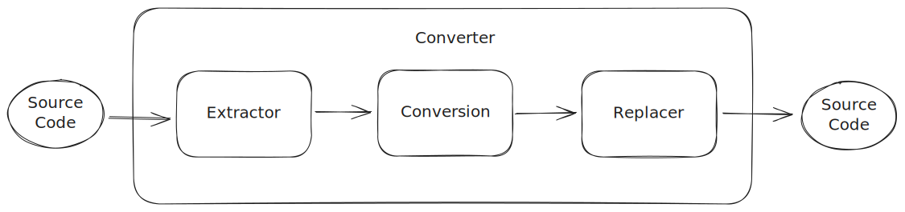

## Architecture of the Converter



The Extractor reads source code as a string and returns Comment objects with these fields:

```python
comment_text: str
comment_range: Range # Start and end index of the comment in the string
symbol_text: str
symbol_range: Range
symbol_type: T
symbol_indentation: str # Save indentation for comment
```

The Conversion calculates a new `comment_text` based on the Comment object (typically from `comment_text`, `symbol_text` and `symbol_type`). This is where the comment conversion happens.

Finally, the Replacer replaces the comments in the string.

Because Extractor and Conversion are protocols, there can be multiple different implementations of them. We created different Conversion implementations to have different "converters".
